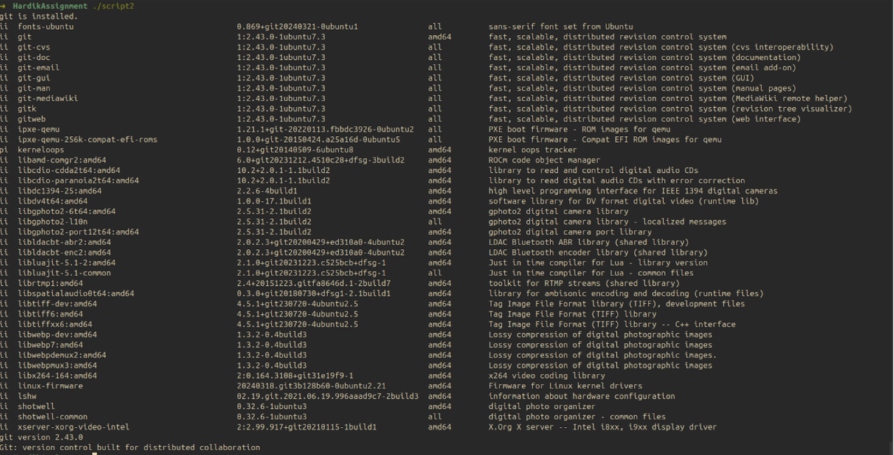

🐧 Open Source Shell Scripting Assignment
Student Details
FieldDetailsNameHardik BajpaiRoll Number24BCE10397Chosen SoftwareGit — a free and open-source distributed version control system licensed under GPL v2

📂 Scripts Overview
This assignment contains 5 Bash shell scripts that explore open source software (Git), system auditing, log analysis, and user interaction on Linux systems.
#Script NamePurpose1System Identity Reporter.shDisplays system and open source software information2Git Package Inspector.shChecks if Git is installed and inspects its package details3Disk and Permission Auditor.shAudits disk usage and permissions for key directories4Git Log Analyzer.shAnalyzes a log file and searches for a keyword5Open Source Manifesto Generator.shInteractively generates a personal open source manifesto

📋 Dependencies
All scripts require the following to be available on your Linux system:
DependencyPurposeCheck CommandbashShell interpreterbash --versiongitVersion control (chosen software)git --versiondpkgPackage manager (Debian/Ubuntu)dpkg --versioncoreutilsBasic tools: du, ls, date, uname, whoamiPre-installed on all Linux distrosgrepPattern searching in filesgrep --versionawkText processingawk --version

⚠️ Note: Scripts 2 and 3 use dpkg, which is only available on Debian/Ubuntu-based systems (e.g., Ubuntu, Linux Mint). On Fedora/Arch, replace dpkg -l with rpm -qa or pacman -Q respectively.

Install Git (if not already installed)
bashsudo apt update
sudo apt install git -y

🚀 How to Run the Scripts
Step 0 — Make All Scripts Executable (do this once)
bashchmod +x "System Identity Reporter.sh"
chmod +x "Git Package Inspector.sh"
chmod +x "Disk and Permission Auditor.sh"
chmod +x "Git Log Analyzer.sh"
chmod +x "Open Source Manifesto Generator.sh"

Script 1 — System Identity Reporter
File: System Identity Reporter.sh
Description:
This script acts as an open source audit report for the system. It collects and displays key system information including the kernel version, current logged-in user, system uptime, Linux distribution name, current date and time, and the installed Git version. It also prints the GPL license associated with the Linux kernel and Git — making it a quick snapshot of the open source environment the user is running in.
Dependencies: git, uname, whoami, uptime, grep, date
How to Run:
bashbash "System Identity Reporter.sh"
Expected Output:

Script 2 — Git Package Inspector
File: Git Package Inspector.sh
Description:
This script checks whether Git is installed on the system using the dpkg package manager. If Git is found, it prints the full package information from dpkg and also displays the Git version. If Git is not installed, it notifies the user. Additionally, the script contains a case block that prints a short open source description for common tools (git, python3, vim, curl), demonstrating awareness of open source software and their community-driven nature.
Dependencies: dpkg, git
How to Run:
bashbash "Git Package Inspector.sh"
Expected Output (if Git is installed):

Script 3 — Disk and Permission Auditor
File: Disk and Permission Auditor.sh
Description:
This script audits a predefined set of important Linux system directories: /etc, /var/log, /home, /usr/bin, and /tmp. For each directory, it checks whether the directory exists and then retrieves its permission string, owner, group, and total disk usage size using ls and du. This is useful for quickly identifying who owns critical directories and how much space they consume. The script also checks for the presence of a .gitconfig file in the home directory and displays its file details if found.
Dependencies: ls, du, awk, cut, bash
How to Run:
bashbash "Disk and Permission Auditor.sh"
Expected Output:

ℹ️ If you do not have a .gitconfig file, run git config --global user.name "Your Name" to create one.

Script 4 — Git Log Analyzer
File: Git Log Analyzer.sh
Description:
This script is a general-purpose log file analyzer. It accepts two command-line arguments: a path to a log file and an optional search keyword (defaults to "git" if not provided). The script reads through the file line by line, counts how many lines contain the keyword (case-insensitive), and then prints the last 5 matching lines. This is useful for scanning system logs, application logs, or any text file for specific terms — particularly useful for checking how often Git-related activity appears in logs.
Dependencies: grep, bash
Arguments:
ArgumentRequiredDescription$1✅ YesPath to the log file to analyze$2❌ NoKeyword to search for (default: git)
How to Run:
With default keyword (git):
bashbash "Git Log Analyzer.sh" /var/log/syslog
With a custom keyword:
bashbash "Git Log Analyzer.sh" /var/log/syslog "error"
Using a sample test file:
bash# Create a test log file first
echo -e "git clone done\ngit commit\nsome other log\ngit push failed\nnormal entry\ngit pull" > test.log
bash "Git Log Analyzer.sh" test.log git
Expected Output:

Script 5 — Open Source Manifesto Generator
File: Open Source Manifesto Generator.sh
Description:
This is an interactive script that prompts the user with three questions about their open source beliefs and preferences. Based on the answers, it generates a personalized open source manifesto — a short statement of intent and belief — and saves it to a text file named manifesto_<username>.txt in the current directory. The current date is automatically included. The generated manifesto is also printed to the terminal immediately after creation. This script highlights the philosophy behind open source software and encourages personal reflection on its values.
Dependencies: date, whoami, bash
How to Run:
bashbash "Open Source Manifesto Generator.sh"
Interactive Prompts:
Answer three questions
1. Tool you use daily: git
2. Freedom means: the ability to study and modify software
3. What will you build? a collaborative version tracker
Expected Output:

🗂️ File Structure
OSS/
├── System Identity Reporter.sh         # Script 1 — System info & open source audit
├── Git Package Inspector.sh            # Script 2 — Git installation checker
├── Disk and Permission Auditor.sh      # Script 3 — Directory permissions & disk usage
├── Git Log Analyzer.sh                 # Script 4 — Log file keyword analyzer
├── Open Source Manifesto Generator.sh  # Script 5 — Interactive manifesto creator
└── README.md                           # This file

⚡ Quick Run — All Scripts at Once
bash# Step 1: Make all scripts executable
chmod +x *.sh

# Step 2: Run Script 1 — System Identity Reporter
bash "System Identity Reporter.sh"

# Step 3: Run Script 2 — Git Package Inspector
bash "Git Package Inspector.sh"

# Step 4: Run Script 3 — Disk and Permission Auditor
bash "Disk and Permission Auditor.sh"

# Step 5: Run Script 4 — Git Log Analyzer (requires a log file path)
bash "Git Log Analyzer.sh" /var/log/syslog git

# Step 6: Run Script 5 — Open Source Manifesto Generator (interactive)
bash "Open Source Manifesto Generator.sh"

🔍 Troubleshooting
ProblemSolutionPermission denied when runningRun chmod +x <scriptname>.sh firstdpkg: command not foundYou are on a non-Debian system; replace with rpm -qa (Fedora)git: command not foundInstall Git: sudo apt install git -yError: File not found (Script 4)Make sure the log file path passed as argument actually exists.gitconfig not found (Script 3)Run git config --global user.name "Your Name" to create it

📝 Notes

All scripts are written for Bash and tested on Ubuntu/Debian-based Linux distributions.
Script 4 (Git Log Analyzer) requires a valid readable file to be passed as the first argument.
Script 5 (Open Source Manifesto Generator) is interactive and requires keyboard input at runtime.
The chosen open source software for this assignment is Git, licensed under the GNU General Public License v2 (GPL-2.0).